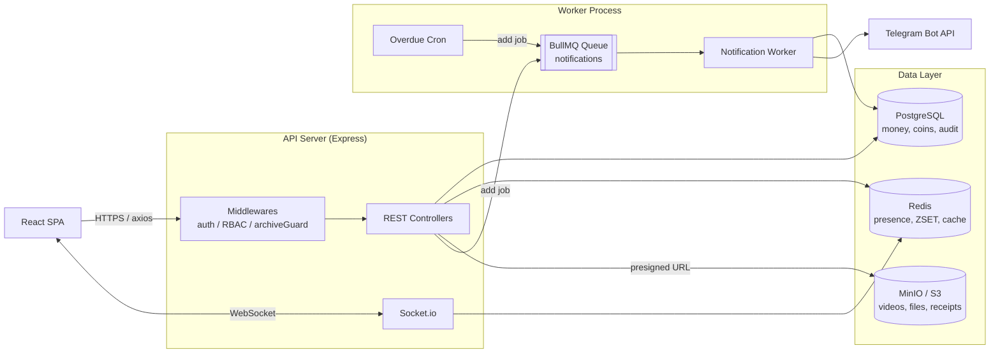
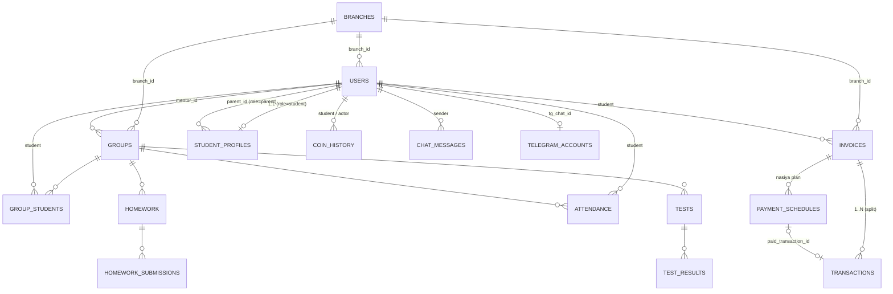
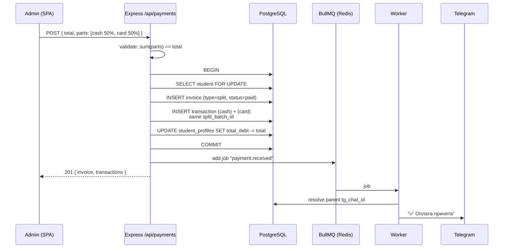
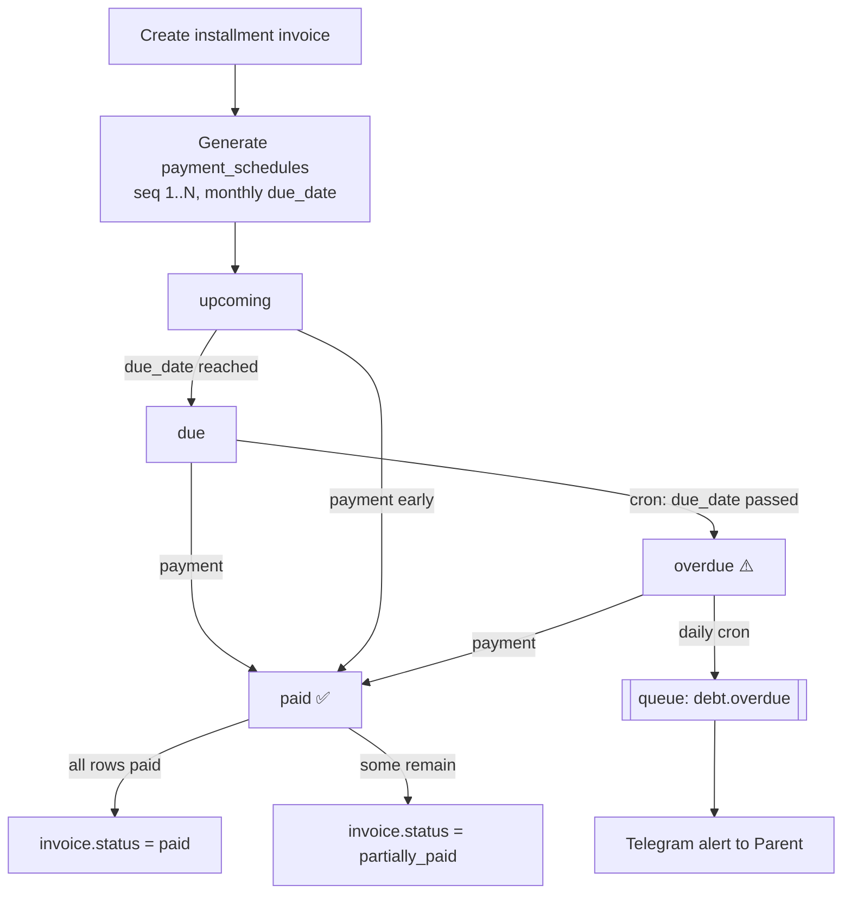
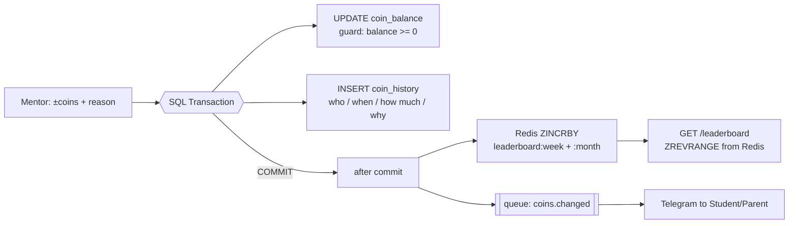
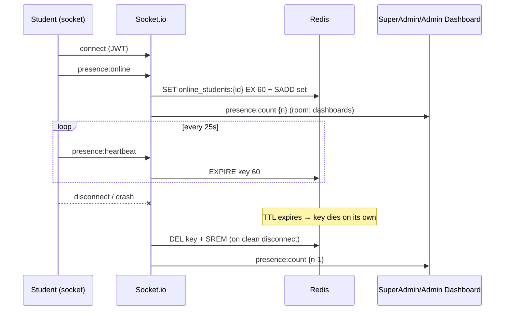
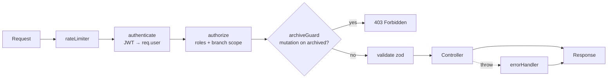

# LevelUp Academy Backend Architecture — Diagrams

Visual architecture of the LevelUp Academy backend: system overview, data model, payment flows, gamification, presence and the notification queue. All diagrams are Mermaid — GitHub renders them natively.

> [!NOTE]
> Full spec with DDL and code: [BACKEND-ARCHITECTURE.md](../BACKEND-ARCHITECTURE.md). This file is the visual map.

---

## System Overview

> [!IMPORTANT]
> **Two processes.** `server.js` (API + sockets) and `worker.js` (queue consumer + cron) run separately. A Telegram outage never blocks an HTTP request — jobs just wait in Redis.

---

## Data Model (core ER)

| Rule | Meaning |
|---|---|
| `branch_id` everywhere | Multi-tenancy ready from day one (seeded Main Branch) |
| `is_archived` vs `deleted_at` | Archive = read-only (GET ok, mutations 403); soft-delete = hidden |
| `NUMERIC(12,2)` | Money is never float |
| `coin_history` append-only | Audit trail; balance is a derived cache |

---

## Split Payment Flow (Cash + Card)

> [!WARNING]
> **Queue after COMMIT only.** The notification job is enqueued strictly after `COMMIT` — otherwise a rolled-back payment could still notify the parent.

---

## Halol Nasiya (Installments)

---

## Coins & Leaderboards

> [!TIP]
> **Fraud-proof by construction.** Balance and audit row change in the **same transaction** — one cannot exist without the other. `balance_after` in each history row makes tampering detectable.

---

## Presence (Live Online Counter)

---

## Request Pipeline (middlewares)

---

## See also

- [Frontend Diagrams](Frontend-Architecture-Diagrams.md) — client-side counterpart
- [BACKEND-ARCHITECTURE.md](../BACKEND-ARCHITECTURE.md) — full specification with code
