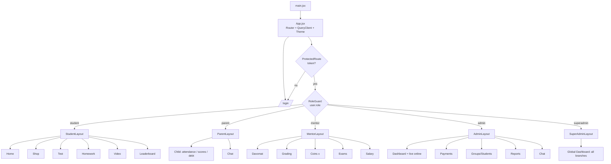
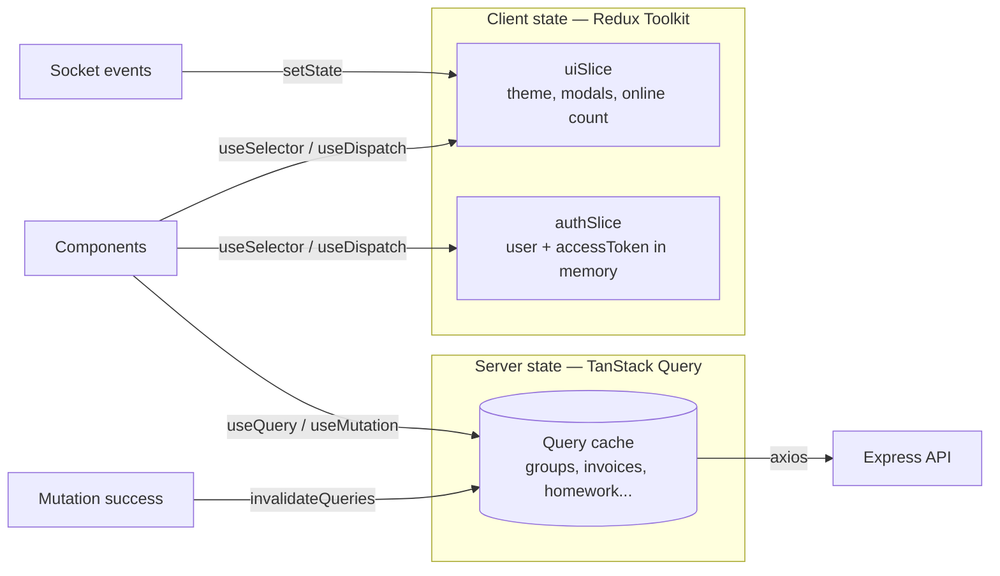
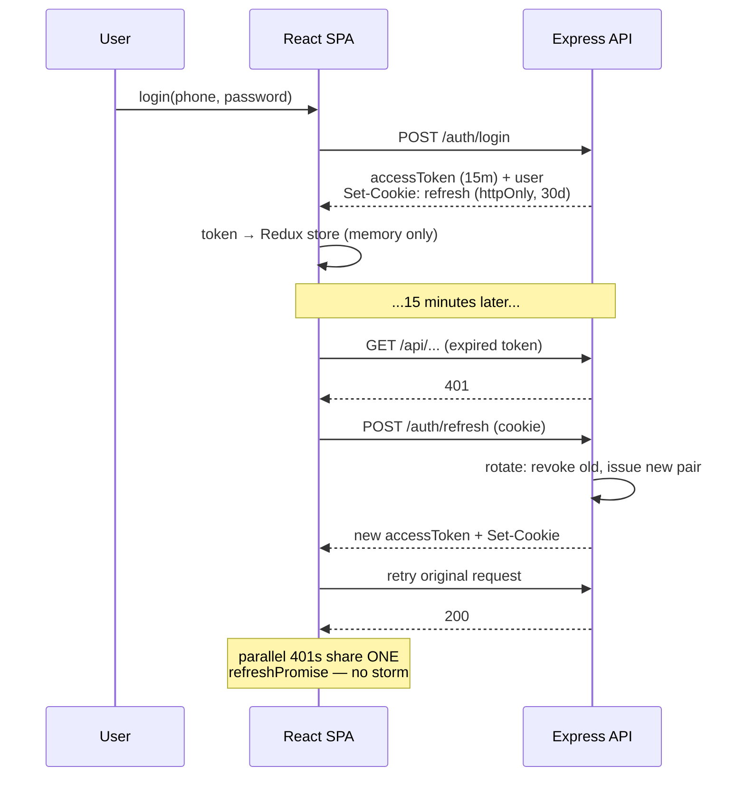
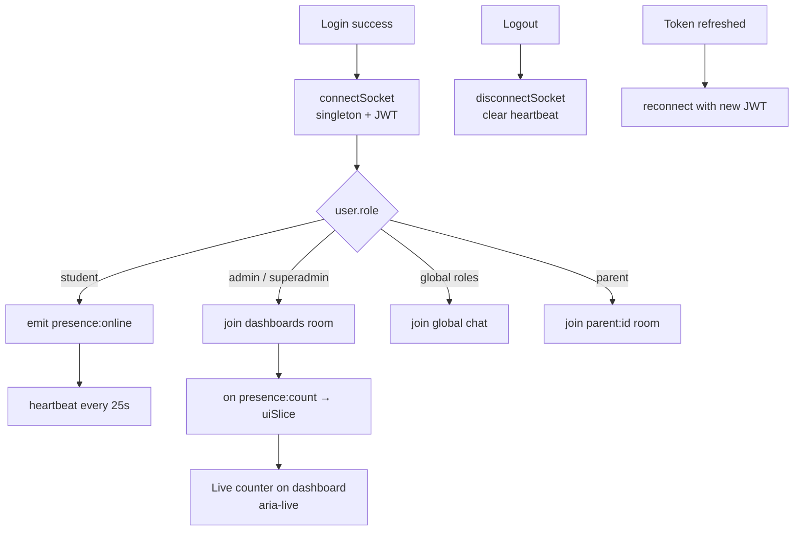
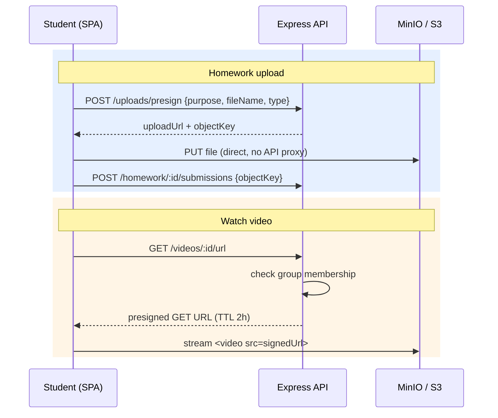
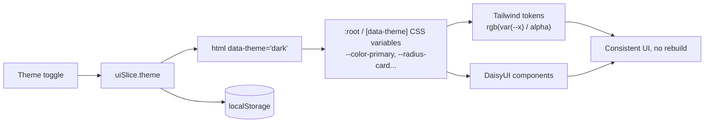
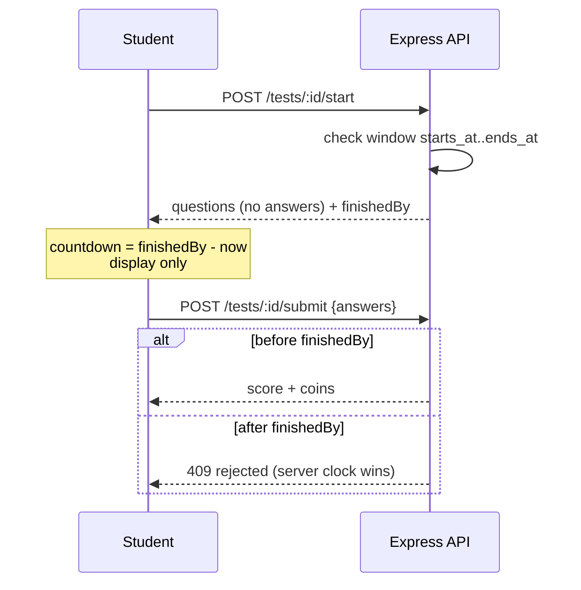

# LevelUp Academy Frontend Architecture — Diagrams

Visual architecture of the LevelUp Academy client: app shell, role routing, data flow, auth refresh, socket lifecycle and file uploads. All diagrams are Mermaid — GitHub renders them natively.

> [!NOTE]
> Full spec with code: [FRONTEND-ARCHITECTURE.md](../FRONTEND-ARCHITECTURE.md). This file is the visual map.

---

## App Shell & Role Routing

> [!TIP]
> **Code-splitting per role.** Each layout is `lazy()` — a student never downloads admin code. After login: `navigate(HOME_BY_ROLE[user.role])`.

---

## Data Flow (two state layers)

| Layer | Tool | Holds |
|---|---|---|
| Server state | TanStack Query | Everything from the API (cache, refetch, invalidation) |
| Client state | Redux Toolkit | auth session, theme, modals, socket status |

---

## Auth: Login & Silent Refresh (rotation)

> [!IMPORTANT]
> **403 from archiveGuard.** The interceptor recognises the archived-entity 403 and fires a global toast — «Архив, только чтение» — instead of logging the user out.

---

## Socket Lifecycle & Live Online

Chat events (match backend): `chat:global:send` → `chat:global:message`, `chat:parent:send` → `chat:parent:message`; history via REST `GET /api/chat/:roomKey/messages?cursor=`.

---

## File Upload (presigned) & Protected Video

---

## Theming (CSS Variables + DaisyUI)

---

## Exam Timer (server-authoritative)

---

## See also

- [Backend Diagrams](Backend-Architecture-Diagrams.md) — server-side counterpart
- [FRONTEND-ARCHITECTURE.md](../FRONTEND-ARCHITECTURE.md) — full specification with code
